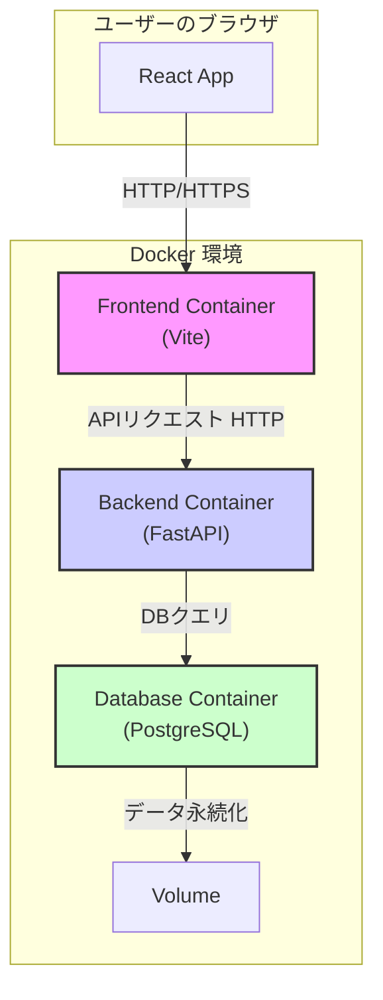

# ブログシステム (Blog System - 17CFP)

## 1. はじめに

本ドキュメントは、プログラミング課題「17CFP」で開発するブログシステムの概要を記したものです。

このプロジェクトは、単なるブログ機能の実装に留まらず、モダンなWeb開発で主流となっているフロントエンドとバックエンドの分離構成を採用し、Dockerによるコンテナ仮想化技術を用いて開発環境の再現性とポータビリティを確保することを目的としています。

## 2. プロジェクトのコンセプト

本システムは、以下の3つのコンセプトを指針として設計・開発を進めます。

### モダンなアーキテクチャ
フロントエンドをReact、バックエンドをFastAPIで構築し、APIを介して疎結合に連携させます。これにより、各層を独立して開発・デプロイすることが可能となり、メンテナンス性や拡張性が向上します。

### 宣言的な環境構築
Docker Composeを利用し、必要なサービス（Webサーバー、APIサーバー、データベース）の構成をコードとして管理します。これにより、「誰が実行しても同じ開発環境」をワンコマンドで構築できます。

### 開発者体験の重視
HMR (ホットモジュールリプレイスメント) やAPIドキュメント自動生成 (Swagger UI) などを導入し、効率的で快適な開発サイクルを実現します。

## 3. 機能一覧

ユーザーに提供する主な機能は以下の通りです。

### ユーザー認証関連
- [x] 新規ユーザー登録機能
- [x] ログイン・ログアウト機能

### 記事関連
- [x] 記事一覧表示機能
- [x] 記事詳細表示機能
- [x] 記事の投稿・編集・削除機能 (投稿者本人のみ)

### コメント関連
- [x] コメント投稿機能 (ログインユーザーのみ)
- [x] コメント表示機能

## 4. 技術選定と採用理由

本プロジェクトで使用する主要な技術スタックと、その選定理由です。

| 領域 | 技術 | 選定理由 |
|---|---|---|
| フロントエンド | React (Vite), TypeScript, Tailwind CSS | コンポーネント指向でUIを効率的に構築でき、大規模開発にも対応可能です。Viteによる高速な開発サーバー、TypeScriptによる型安全性、Tailwind CSSによる柔軟なスタイリングが開発効率を大きく向上させます。 |
| バックエンド | Python (FastAPI), Pydantic | Pythonの豊富なライブラリを活用しつつ、Node.jsに匹敵する高いパフォーマンスを発揮します。Pydanticによる型ヒントベースのデータバリデーションと、APIドキュメントの自動生成機能が強力です。 |
| データベース | PostgreSQL | 高機能で信頼性の高いオープンソースのリレーショナルデータベースであり、複雑なクエリやデータ整合性が求められるWebアプリケーションに適しています。 |
| インフラ | Docker, Docker Compose | 各コンポーネントを独立したコンテナとして実行することで、環境依存の問題を解消し、開発から本番まで一貫した環境を容易に構築できます。 |
| 認証 | JWT (JSON Web Token) | トークンベースの認証方式であり、サーバー側でセッション状態を保持する必要がないため、ステートレスなAPIアーキテクチャと非常に相性が良いです。 |

## 5. システム構成図

各コンポーネントはDockerコンテナとして起動し、Dockerネットワークを介して相互に連携します。



## 6. ローカル開発環境のセットアップ

### 6.1. 前提条件

以下2つのツールがご自身のPCにインストールされている必要があります。

- Docker
- Docker Compose

### 6.2. 起動手順

#### 1. リポジトリのクローン
まず、プロジェクトファイルをローカルにコピーします。

```bash
git clone <your-repository-url>
cd <your-repository-name>
```

#### 2. 環境変数ファイルの設定
データベースのパスワードなど、環境固有の変数を設定します。`.env.template` をコピーして `.env` ファイルを作成し、エディタで開いて内容を適切に編集してください。

```bash
cp .env.template .env
```

#### 3. Dockerコンテナのビルドと起動
Docker Composeを使い、定義された全てのコンテナをビルドし、バックグラウンドで起動します。

```bash
docker-compose up --build -d
```

> **注:** 初回起動時はイメージのダウンロードとビルドに数分かかることがあります。

#### 4. アプリケーションへのアクセス
起動が完了したら、ブラウザで以下のURLにアクセスしてください。

- **フロントエンド**: http://localhost:3000
- **バックエンド APIドキュメント (Swagger UI)**: http://localhost:8000/docs

### 6.3. 停止方法

コンテナを停止し、関連するネットワークなどを削除するには、以下のコマンドを実行します。

```bash
docker-compose down
```

## 7. ディレクトリ構成

プロジェクトの主要なファイルとディレクトリの役割です。

```
.
├── .env                  # (要作成) 環境変数を定義するファイル
├── .env.template         # .envファイルのテンプレート
├── docker-compose.yml    # Dockerコンテナ群の構成を定義するファイル
├── backend/              # バックエンド (FastAPI) のソースコード
│   ├── Dockerfile        # バックエンド用のコンテナをビルドするための設計図
│   └── src/              # FastAPIアプリケーションのソースコード
└── frontend/             # フロントエンド (React) のソースコード
    ├── Dockerfile        # フロントエンド用のコンテナをビルドするための設計図
    └── src/              # Reactアプリケーションのソースコード
```
